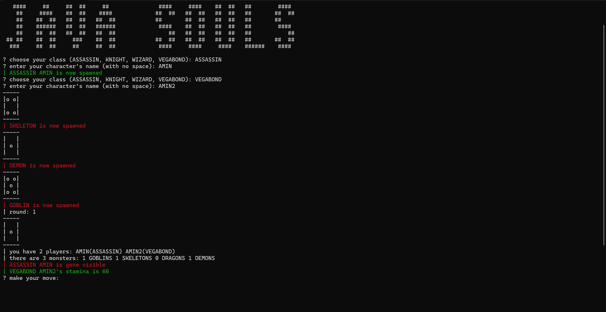
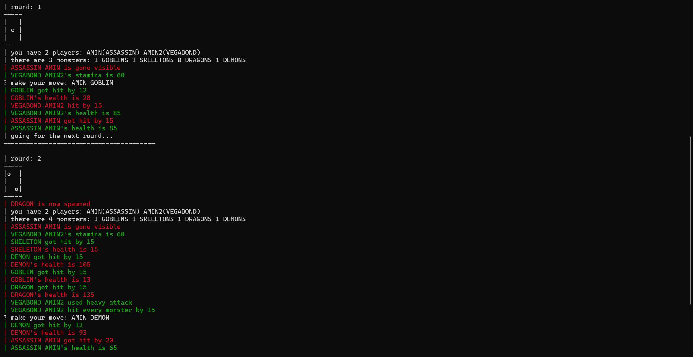

# Java Souls


## Description

Java Souls is a terminal rpg game with dice-rolling system and turned-based combats. Every move of player should be typed and game statistics are shown through logs.

### Features

- Choose your class and create several characters
- Fight with enemies and win the game
- Watch every combat move with colorful logs

### Screenshots




### Structure


## Getting Started

You can download the latest release on this GitHub page

### Dependencies

- Windows 10 or later (macOS or Linux is not guaranteed)
- Java SE Runtime 8 or later
  
### Installation and Execution

1. Download release from [this link](https://github.com/Amin-Gh-05/Java-Souls/releases/)
2. Go to file directory and launch it useing the following command
```java -jar Java-Souls.jar```
3. Enjoy the game!

### Playing the Game

As you enter the game, you should create 2 characters with name and class - This shall be done every 3 rounds

After creating chars, 3 monsters will be spawned randomly - This will happen every 2 rounds

for each move, type the character name and the enemy class as target (seperated with space and in upper case)

## Authors

Amin Ghoorchian

[Contact on Telegram](https://t.me/AminGh05)

## Version History

- 1.0.1
  - bug fixes
  - exceptions handled
  - improved features

- 1.0.0
  - first stable version
  - functionality almost done
 
## Acknowledgements

- [SBU Mathematics and Computer Science Department](https://mathsci.sbu.ac.ir/)
- [Shayan Shahrabi (As Mentor)](https://github.com/ShayanShahrabi)
